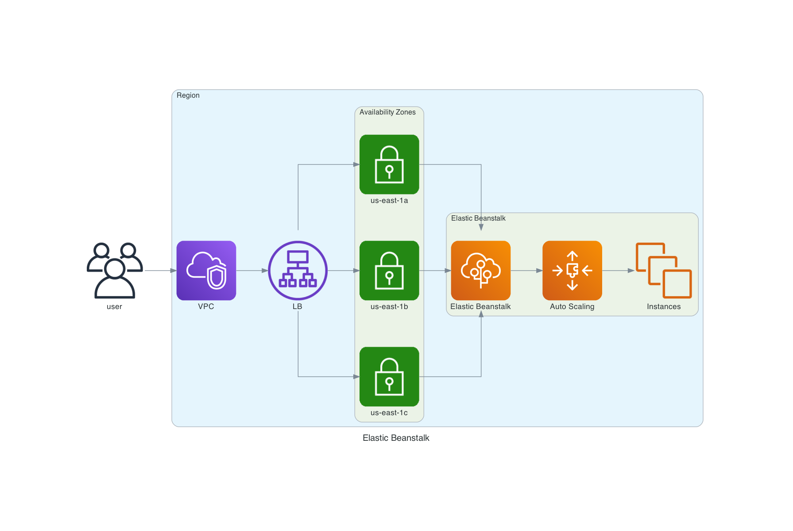
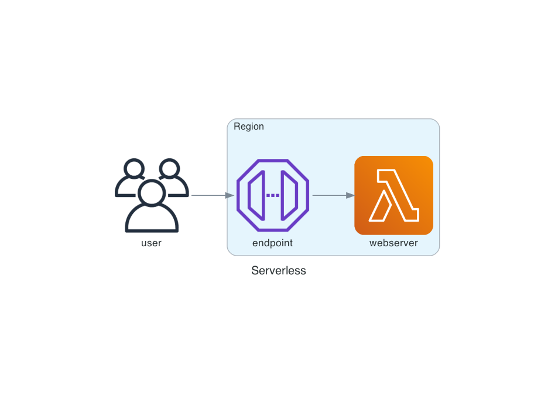

# Overview


### URLs 
 - Serverless - https://y3vnp0d8li.execute-api.us-east-1.amazonaws.com
 - Elastic Beanstalk - http://devops-dev.eba-7mdbhyms.us-east-1.elasticbeanstalk.com/


### Endpoint
 - `GET /`
```text
Hello! 
```
 - `GET /hello`
```text
Hello World from Frontrow!
```

 - `GET /quote` (random quote)
```json
{
  "author": "Edsger W. Dijkstra",
  "text": "Progress is possible only if we train ourselves to think about programs without thinking of them as pieces of executable code. "
}
```


## Diagrams

### Elastic Beanstalk 


### Serverless 



